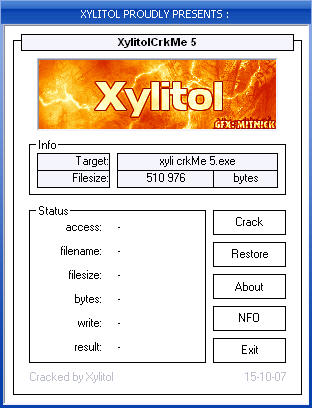



## A Patch in VB

### Description

Plop All

Then here it is a patch quickly make in VB

what I want to say by &#8220;patch&#8221;

is to modify certain bytes has a precise address

on .exe from other .exe

To modify a .EXE by modifying a party of the

desired hexadecimal code the program will seek it.

Exe to be modified,

if it and not in the same repertory

Common dialog will propose to you of sought manually

before patching it checks for the moment 2 parameter:

- the size of the file

- the name of the file

The patch is satisfied with patch stup*dly

as soon as the two parameters are ok

Pas recognition of CRC nor nothing for the moment but that comes

With and it makes a copy right at the time or it prepares patching

and the extension modifies. Exe in .bak as that if something this master key badly one will have the original file

Also compiled not compil to p-code

bus there is uFMOD to play of the XM

and it will not like that

for Ufmod you will have surely difficulty compiled

by what it is necessary changed LINK.exe then if

it is the case to download package: http://sourceforge.net/project/platformdownload.php?group_id=158498

for files XM I do not want to make you a large pie

it is already rather long has to read as that then

I invite you went to look on wikipedia here - &gt;

http://fr.wikipedia.org/wiki/Module_(musique) #
 
### More Info
 

             |
---                |---
**Submitted On**   |2007-10-24 15:54:30
**By**             |[Xylitol](https://github.com/Planet-Source-Code/PSCIndex/blob/master/ByAuthor/xylitol.md)
**Level**          |Beginner
**User Rating**    |5.0 (10 globes from 2 users)
**Compatibility**  |VB 6\.0
**Category**       |[Coding Standards](https://github.com/Planet-Source-Code/PSCIndex/blob/master/ByCategory/coding-standards__1-43.md)
**World**          |[Visual Basic](https://github.com/Planet-Source-Code/PSCIndex/blob/master/ByWorld/visual-basic.md)
**Archive File**   |[A\_Patch\_in2110774252008\.zip](https://github.com/Planet-Source-Code/xylitol-a-patch-in-vb__1-70460/archive/master.zip)

